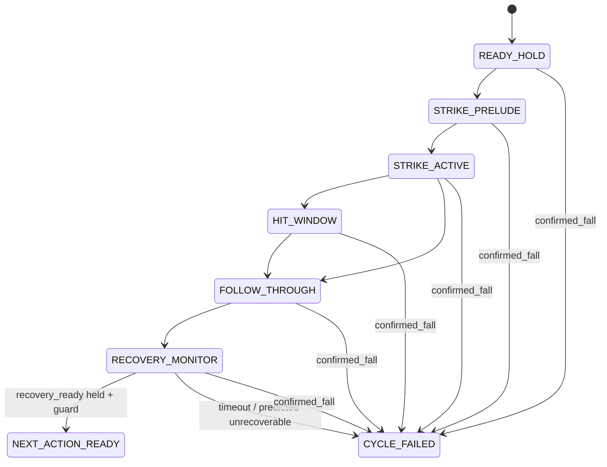

# 跌倒检测与恢复准入系统审计（V1）

本文件对应 `/home/bistu/下载/hope-training 跌倒检测与恢复准入系统审计方案.docx`，是项目内的可审计实现记录。训练准入在本文件及其证据未全部通过前保持关闭。

## 当前真实调用链

```text
ManagerBasedRLEnv.step
  -> MotionCommand._update_command
       -> 有限 reference 进入 final frame / hold tail
  -> action manager
       -> frozen upper/lower prior + current action
  -> physics step
  -> reward manager
       -> strict_fall_risk_l2 -> unified_fall_state
  -> termination manager
       -> StrictRootFallExceeded -> unified_fall_state.confirmed_fall
       -> non_foot_ground_contact（现有独立 contact term）
  -> env reset（若 terminated/timeout）
```

`MotionCommand.begin_next_shot()` 是不写入物理状态的显式换动作入口，但当前调用方必须在进入前检查恢复准入；不能把环境自动 reset 当作下一动作成功。`hold_last_frame_steps` 只保留 reference 尾帧，不能替代 recovery monitor。

## 已复现的历史漏判证据

旧 root-only 回放曾报告最大 root tilt 约 `22.89°`、无 termination。加入 `torso_Link` 后，确定的两次可视化动作分别在：

- `eval_outputs/p5u1_model499_motion0_two_actions_torso45_trace_v2.json` step `258`：root `18.953°`，torso `45.902°`，触发 `strict_fall`；
- 同一 trace step `384`：root `23.640°`，torso `46.486°`，触发 `strict_fall`。

这证明单独检查 root 会漏掉上身塌倒；新统一源同时读取 pelvis/root 与 `torso_Link`。

## 状态转换图



## 四个物理语义

| 语义 | 统一输出 | 是否等同确认跌倒 |
|---|---|---|
| Fall risk | `risk_score`, `risk_level` | 否 |
| Predicted unrecoverable | `predicted_unrecoverable` | 否 |
| Confirmed fall | `confirmed_fall`, `fall_reason` | 是 |
| Recovery ready | `recovery_ready`, `recovery_progress` | 否；它是下一动作准入 |

实现入口：`training/tasks/tracking/mdp/fall_state.py`。

## 已实现的统一状态输出

`UnifiedFallState` 每个 simulator control step 至多更新一次，并缓存给 reward/termination：

- 不可变的 initial-base-heading forward/lateral frame；signed forward/left tilt；
- root/pelvis 与 `torso_Link` 姿态、角速度、相对支撑平面高度；
- 质量加权 CoM、CoM velocity、capture point；
- front/rear/left/right 四个正向 support margins；
- 双脚 force contact、脚底滑移、非足部接触；
- 关节位置/速度的 actuator saturation proxy；
- continuous risk components；
- 0.10/0.20/0.30/0.50 s 的 tilt/height/capture-margin prediction；
- debounce 后的 `confirmed_fall`；`predicted_unrecoverable` 不会直接改写为 confirmed；
- 双脚、非法接触、相对高度、倾角/角速度、CoM 速度、capture margin、slip 和稳定保持计数构成的 recovery gate。

## 当前代码证据

- `StrictRootFallExceeded` 已改为读取统一 `confirmed_fall`，不再独立计算 root/torso 终止逻辑。
- `strict_fall_risk_l2` 已读取统一 `risk_score`，并暴露 `env.unified_fall_risk_components`。
- `stagger_support_state` 也已冻结每个 episode 的初始 base-heading；support/capture 方向不会随当前 root yaw 旋转。
- 旧版 step-recovery 入口对统一状态字段缺失 fail-closed，不再默认 `True`；要求 `risk_score/risk_level/fall_direction/recoverability/predicted_front_margin/root_recoverable/signed forward tilt/confirmed/predicted`。确认跌倒会阻断 step；预测不可恢复只允许受限 rescue 分支。
- `StrikeCycleManager` 已提供显式 `READY_HOLD/STRIKE_PRELUDE/STRIKE_ACTIVE/HIT_WINDOW/FOLLOW_THROUGH/RECOVERY_MONITOR/NEXT_ACTION_READY/CYCLE_FAILED` 状态、post-hit guard、recovery hold 与 timeout/fall 优先级；Stage-A coordinator 已创建并更新该 manager，multi-shot replay 在调用 `begin_next_shot()` 前还会检查统一 `recovery_ready`。
- `tests/test_fall_state_contract.py`：signed axes 与预测/确认语义测试。
- 历史 FSM contract tests：更新为显式传入 recoverability；现有 8 项 contract tests 通过。
- `scripts/play.py` 的 `record_trace` 快照和视频帧现在包含统一 risk/state/reason、signed tilt、相对高度、CoM/capture/CoP、四边 margin、脚滑移、非法接触、prediction、confirmed/recovery-ready；视频 overlay 是诊断显示，JSON trace 是权威证据。
- multi-shot partial report 现在保留最近 100 个 reset 前 control-step 状态，避免 vector-env auto-reset 抹掉延迟跌倒证据。
- 已建立 `contracts/fall_trace_annotation_v1.schema.json` 与 `contracts/fall_threshold_calibration_v1.json`，但当前尚无足够人工标注 trace 和独立 seed 标定结果，因此阈值仍是候选值，不得视为正式标定。

## 仍未完成的准入项

以下项目在 PhysX 证据完成前不能宣称通过：

1. `READY_HOLD -> STRIKE_PRELUDE -> STRIKE_ACTIVE -> HIT_WINDOW -> FOLLOW_THROUGH -> RECOVERY_MONITOR -> NEXT_ACTION_READY/CYCLE_FAILED` 的完整 cycle manager；
2. motion end 后 50–100 control-step post-hit guard、recovery timeout 与“timeout 不覆盖 fall”的终止优先级；
3. `begin_next_shot()` 的统一 `recovery_ready` 硬准入；
4. illegal contact 立即确认与普通多条件 3–5 步 debounce 的独立审计标签；
5. recovery-ready 稳定保持 10–20 步的实际运行接线；
6. 所有风险分量、预测量、CoP/support polygon 和 contact 细节的 overlay/per-step trace；
7. reset 前至少保存 50–100 步 trace；
8. 人工标注数据集、阈值独立 seed 标定、单位/frame/version 元数据；
9. D0–D6 PhysX 场景：稳定 READY、可恢复扰动、受限 step-recovery、前倒不可恢复、post-hit 延迟倒、长恢复、foot slip；
10. precision/recall、risk lead-time P10/P50/P90、false emergency/confirmed/ready、guard 捕获率、recovery timeout、premature next-action 报告；
11. 训练 admission gate：上述审计通过前禁止未审计的 F0–F8 和教师资格批准。

## 明确禁止的替代逻辑

- 只看 world root z、绝对 pitch 或单一 contact；
- 把 near-fall 当 confirmed fall；
- 把 predicted unrecoverable 当 physical fall；
- reset 立即隐藏跌倒；
- 用普通 timeout 覆盖 confirmed fall；
- 命中窗口通过即宣布 whole-cycle success；
- 单帧 `recovery_ready`；
- 没有 post-hit guard 或 reset 前 trace；
- 没有 PhysX D0–D6 验证就开放训练。

## 审计状态

当前状态：**IMPLEMENTATION_IN_PROGRESS / TRAINING_ADMISSION_CLOSED**。

训练入口现已对所有 `AgibotA3` 的 `Floating*` 任务统一 fail-closed，
不再只拦截历史 `FloatingF0--F8` 名称；固定基座和非 A3 任务不受此门禁影响。

统一物理状态源、基础合同、周期守卫、恢复准入查询、运行时 trace/overlay 与训练 fail-closed 入口已落地并通过轻量单元测试；真实场景运行时兼容性、D0–D6 PhysX 证据、人工标注统计和阈值校准仍待完成，不能将当前状态称为最终通过。

## 2026-08-04 runtime smoke 更新

安装 `warp-lang` 后通过 `AppLauncher` 进入真实 Isaac Sim/PhysX。最小 F0 reset/step 暴露并修复了两处实际问题：

1. `MotionLibraryLoader` 的多 reference strike-state 采样错误地把 frame 当成 motion 维度索引；现已按每个 manifest motion 缓存命中状态。
2. `A3FloatingF0EnvCfg` 原先只激活 `time_out`，没有激活统一 `strict_fall`；现已继承 `A3StrikeStabilizerATerminationsCfg`。

当前逐场景证据汇总在 [fall_recovery_physx_audit_v1.json](/home/bistu/桌面/HOPETableTennis/hope_training/whole_body_tracking/eval_outputs/fall_recovery_physx_audit_v1.json)。D0/D1/D3/D5/D6 使用修正后的 reset-before 快照版本：

```text
D0 PASS    nominal READY hold
D1 PASS    recoverable perturbation and held recovery_ready
D2 NOT_RUN（已补回 evaluation-only MicroStepController/IK/action 源文件，但尚未接入独立 PhysX audit task；不能把纯控制器 smoke 当作 D2 证据）
D3 PASS    forward unrecoverable perturbation terminates
D4 FAIL    nominal zero-action plant 在注入 post-hit 延迟倒之前已先失稳（第 74 步 pre-reset；torso tilt=0.791 rad、support margin=-0.338 m、predicted_unrecoverable=true、confirmed_fall=true、active term=strict_fall）
D5 PASS    long recovery hold
D6 PASS    foot-slip signal observed
```

这组结果证明了统一检测器和 F0 termination 的真实调用链，但不构成 D0–D6 全部通过；因此训练准入仍关闭。

`env.step()` 会在 termination 计算后自动 reset。审计 harness 现在在 `_reset_idx` 前捕获统一状态和 active termination term，避免把 reset 后的零状态误当作跌倒前状态。

`contracts/fall_detection_recovery_admission_v1.json` 已显式记录当前关闭状态；`scripts/train.py` 对 Floating/F0–F8 在签字门未通过时 fail-closed，因而不会误启动未审计训练。
